<div align="center">

# 💵 AhorraPe — Fintech para Niños

**Aplicación móvil de educación financiera y ahorro**


</div>

---

## Descripción General

**AhorraPe** es una app fintech para Android e iOS orientada a niños y jóvenes que busca fomentar hábitos de ahorro de forma divertida y colaborativa. Permite registrar ingresos y gastos, crear metas de ahorro personales, participar en grupos de ahorro colaborativo, y vincular una **alcancía física** mediante escaneo de QR para unir el mundo físico con el digital.

---

## Pantallas de la Aplicación

### Dashboard y Transacciones

|                   Inicio                   |                 Agregar Transacción                 |                       Historial                       |
| :----------------------------------------: | :-------------------------------------------------: | :---------------------------------------------------: |
|       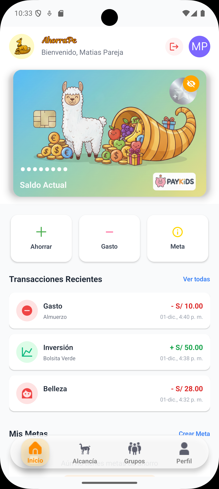        | 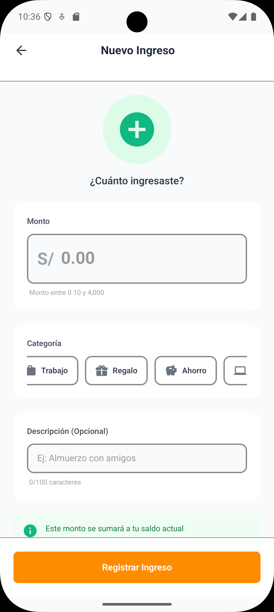 | 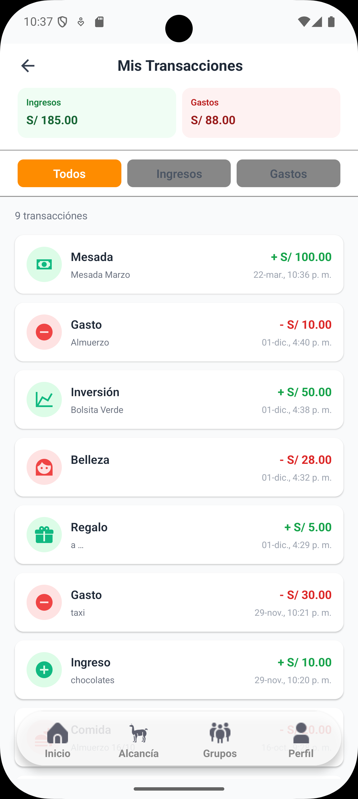 |
| _Balance, metas activas y accesos rápidos_ |     _Registro de ingreso o gasto por categoría_     |            _Historial filtrable por tipo_             |

---

### Metas de Ahorro

|            Mis Metas            |                 Crear Meta                  |              Abonar a Meta              |
| :-----------------------------: | :-----------------------------------------: | :-------------------------------------: |
| 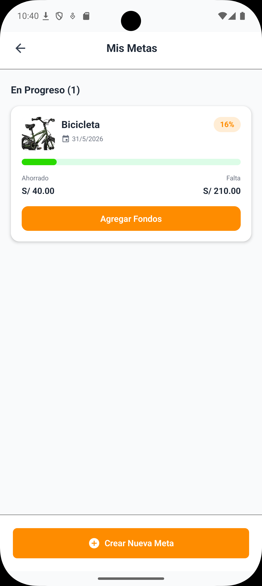 | 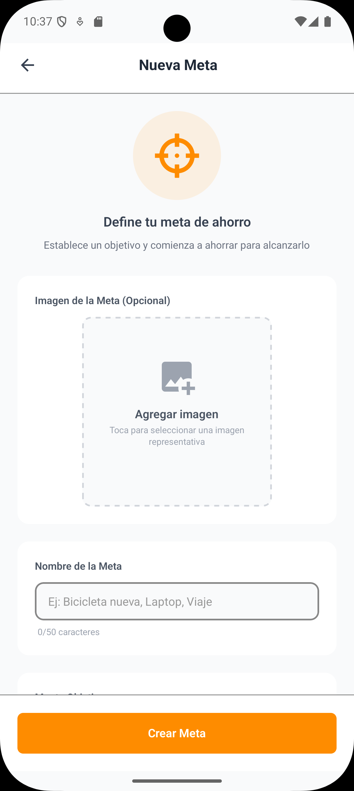 | 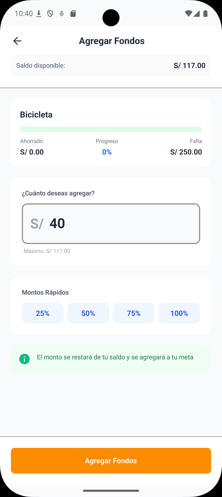 |
| _Lista de objetivos personales_ |  _Nueva meta con imagen y monto objetivo_   |       _Aportar saldo a una meta_        |

---

### Grupos Colaborativos

|              Grupos               |               Detalle de Grupo                |                Meta Grupal                |
| :-------------------------------: | :-------------------------------------------: | :---------------------------------------: |
| 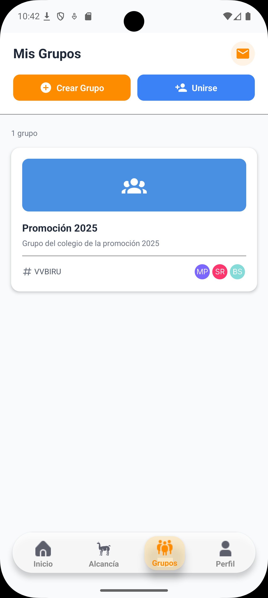 | 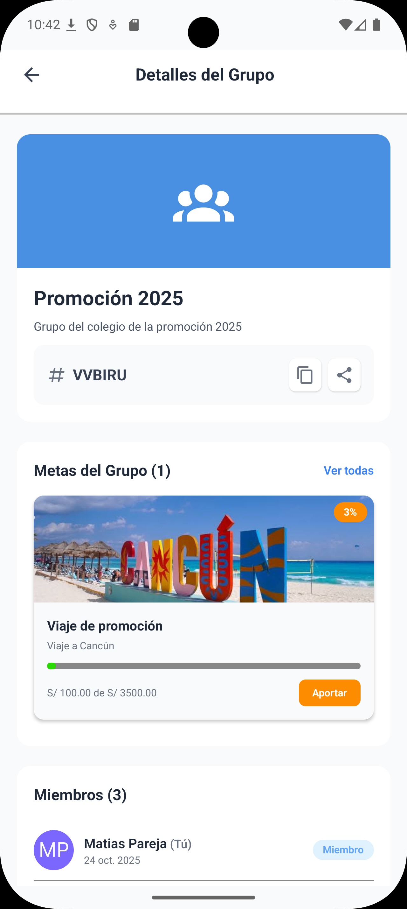 | 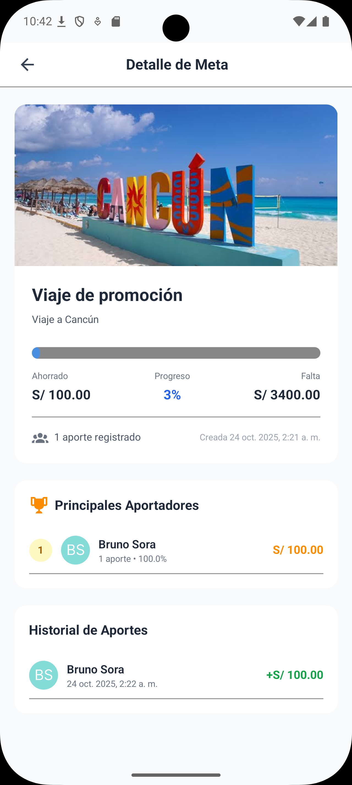 |
|  _Grupos activos e invitaciones_  |          _Miembros e invitar amigos_          |      _Objetivo compartido del grupo_      |

---

### Alcancía Física

|             Escanear QR             |            Vincular             |
| :---------------------------------: | :-----------------------------: |
| 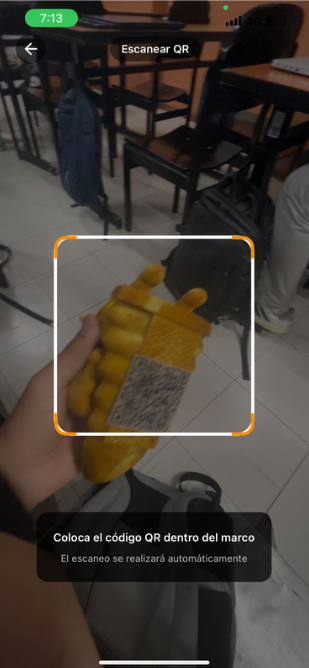 | 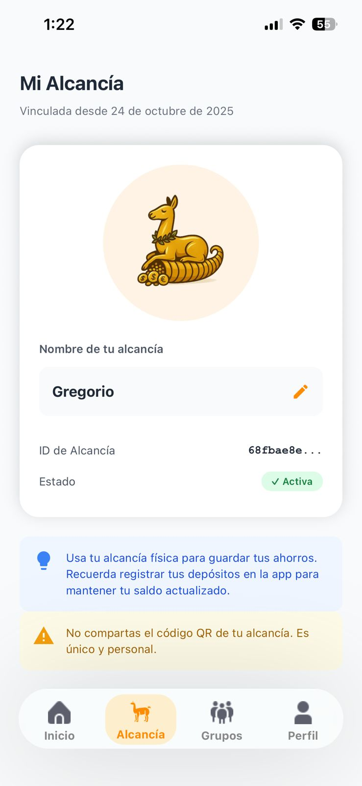 |
|    _Cámara para leer QR físico_     | _Asignar nombre al dispositivo_ |

---

### Perfil

|             Mi Perfil             |  |  |
| :-------------------------------: | :-------------------------------------------: | :---------------------------------------: |
| 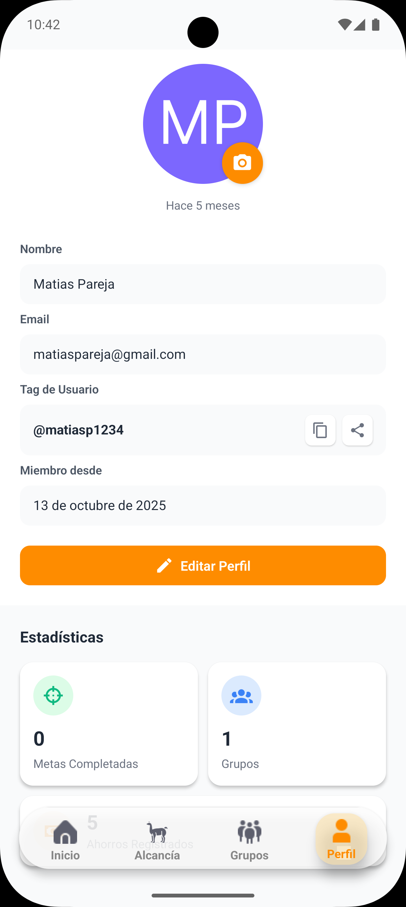 |  |  |
|  _Perfil de usuario y métricas_   |  |  |

---

## Funcionalidades Principales

### Dashboard y Transacciones

- Balance en tiempo real con formato por divisa seleccionada
- Registro de **ingresos** y **gastos** clasificados por categorías personalizadas

### Metas de Ahorro Personales

- Creación de metas con nombre, imagen, monto objetivo y fecha límite
- Abono parcial de fondos desde el saldo disponible
- Visualización de progreso hacia cada meta

### Ahorro Colaborativo (Grupos)

- Crear grupos e invitar amigos por código
- Metas grupales compartidas con seguimiento de aportes por miembro

### Alcancía Física

- Escaneo de QR único impreso en la alcancía física para vincularla a la cuenta

---

## Arquitectura

La app usa **Expo Router** para navegación basada en archivos y **Zustand** como store global de estado de sesión.

```
app/
├── (auth)/                  → Welcome, Sign-In, Sign-Up
├── (setup)/                 → Configuración inicial de cuenta
├── (tabs)/
│   ├── index.tsx            → Home Dashboard
│   ├── add-transaction.tsx  → Nueva transacción
│   ├── transaction-list.tsx → Historial de transacciones
│   ├── metas.tsx            → Metas personales
│   ├── grupos.tsx           → Grupos colaborativos
│   └── alcancia.tsx         → Alcancía física
└── (alcancia)/
    ├── scan-qr.tsx          → Escaneo de QR
    └── claim-alcancia.tsx   → Vinculación de dispositivo

store/
└── auth.store.ts            → Zustand (useAuthBear)

lib/appwrite/
├── index.ts                 → Auth + Transacciones + Metas
├── grupos.service.ts        → Grupos e invitaciones
└── alcancia.service.ts      → CRUD de alcancías
```

---

## Stack Tecnológico

| Tecnología                | Versión | Uso                          |
| ------------------------- | ------- | ---------------------------- |
| **React Native / Expo**   | SDK 54  | Framework multiplataforma    |
| **TypeScript**            | 5.x     | Tipado estático              |
| **Expo Router**           | latest  | Navegación file-based        |
| **Zustand**               | latest  | Estado global de sesión      |
| **Appwrite**              | latest  | Auth, Base de datos, Storage |
| **NativeWind (Tailwind)** | v4      | Estilos en React Native      |
| **expo-camera**           | latest  | Escaneo de QR (Alcancía)     |

---

<div align="center">
  Desarrollado por <a href="https://github.com/MatiasParejaG">MatiasParejaG</a>
</div>
